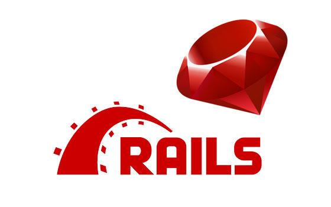

# A toy app

> First Rails app.

    

This project is the first approach at using Ruby on Rails Framework. The purpose is to get a high-level overview of Ruby on Rails programming (and web development in general) by rapidly generating an application using scaffold generators, which create a large amount of functionality automatically

## Built With

- Ruby on Rails

## Live Demo

[Live Demo Link]()

## Authors

👤 **Ivan Ulises Guzman Sanchez**

- Github: [@fivan18](https://github.com/fivan18)
- Twitter: [@fivanunam](https://twitter.com/fivanunam)
- Linkedin: [fivan](https://www.linkedin.com/in/fivan)

👤 **Remy Certil**

- Github: [@certilremy](https://github.com/certilremy)
- Twitter: [@certilremy](https://twitter.com/certilremy)
- Linkedin: [certilremy](https://linkedin.com/in/certilremy)

## 🤝 Contributing

Contributions, issues and feature requests are welcome!

Feel free to check the [issues page](https://github.com/certilremy/Getting-Your-Feet-Wet/issues).

## 📝 License

This project is [MIT](lic.url) licensed.
